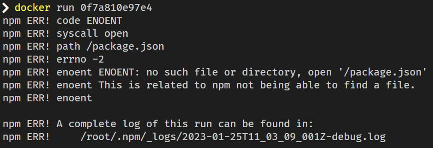
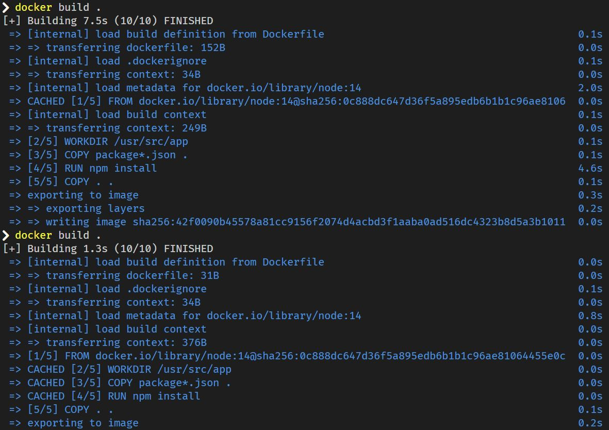

# FROM node

- 도커 라이브러리에는 리눅스 배포판 뿐만 아니라 node.js도 제공하고 있기 때문에 베이스 이미지로 node.js를 사용할 수 있습니다.

# package.json이 없다고 나오는 이유

- 

- Dockerfile에서 추가적인 파일 설치에 대한 명령으로 `npm install`을 사용했습니다. `npm install`은 package.json에 명시된 종속성을 확인하고 필요한 패키지를 설치합니다.

- 베이스 이미지로 임시 컨테이너를 생성할 때 임시 컨테이너는 베이스 이미지의 스냅샷을 사용합니다. 그러므로 베이스 이미지 외 추가적인 파일인 package.json은 빌드가 될 때 임시 컨테이너의 파일 시스템 안에 없는 상태입니다.

## COPY

- Dockerfile에 `COPY`명령을 사용해서 해결할 수 있습니다. `COPY [복사할 파일 명] [복사될 경로]`를 사용해서 package.json을 컨테이너로 복사한다면 `COPY package.json .`으로 사용할 수 있습니다.

- 그리고 server.js 파일도 베이스 이미지 외의 파일이기 때문에 `COPY`명령어로 추가를 해줘야 합니다. 이때 모든 파일들을 추가해주려면 `COPY . .`를 사용해서 dockerignore에 해당하지 않는 모든 파일을 빌드에 포함시킬 수 있습니다.

## 컨테이너 실행 후 접속이 되지 않는 이유

- 컨테이너를 실행할 때 로컬에서의 포트와 컨테이너 내부의 포트를 맵핑시켜야 합니다.

- `docker run -p [호스트 포트]:[컨테이너 내부에 명시한 포트]/[프로토콜] [이미지 이름/ID]`

- 사용자의 호스트 포트를 컨테이너를 위한 포트로 사용한다고 볼 수 있습니다.

- 현재 server.js 파일에선 8080 포트로 명시를 해뒀기 때문에 `docker run -p 8080:8080 [이미지 ID]`로 실행시킨 후 셸에 출력되는 `http://localhost:8080`를 접속하면 Hello World가 출력되는 것을 확인할 수 있습니다.

- 

## 워킹 디렉토리 명시하기

- 워킹 디렉토리를 명시하지 않으면 `COPY`로 추가한 소스 파일들이 컨테이너가 가지는 루트 디렉토리에 놓입니다. 이 파일들을 정리해서 한 디렉토리 안에 모아 놓으려면 워킹 디렉토리를 명시해야 하고 `WORKDIR [경로]`로 사용합니다.

## 종속성 재설치로 인한 빌드 속도 저하 개선

- 종속성에 대한 부분은 변경되지 않고 소스 파일만 변경된 상태에서 빌드를 하면 소스 파일의 작은 부분만 변경이 되더라도 node_modules의 재설치가 이루어집니다.

- 이 부분을 피하기 위해 `RUN npm install` 이전에 `COPY package*.json .`으로 종속성에 대한 복사를 먼저 하고 그 다음 그것의 설치를 진행한 후 나머지 소스 파일 모두를 복사합니다.

- 그리고 종속성에 대한 부분은 캐시된 파일들을 사용합니다.

- 

## 도커 볼륨으로 컨테이너 실행해서 소스 파일 변경 빌드 생략하기

- 소스 파일에 변경 사항에 대한 빌드를 피하기 위해 도커 볼륨을 이용해 로컬에 있는 파일들을 컨테이너 내부의 파일 시스템에 마운트 시킬 수 있습니다.

- `docker run -v [로컬 경로]:[컨테이너 경로]`로 맵핑해서 로컬 경로로 명시된 디렉토리 내의 파일들을 참조하게 할 수 있습니다.

- 로컬에 설치하지 않은 node_modules 같은 디렉토리는 로컬 경로를 명시하지 않고 컨테이너 내부에 설치될 경로만 명시하면 컨테이너는 이미지 생성 시 설치된 node_modules의 경로를 참조하여 사용합니다. `docker run -p 8080:8080 -v /usr/src/app/node_modules -v ${pwd}:/usr/src/app [이미지 ID]`

- 도커 볼륨으로 실행시킨 컨테이너는 새로 빌드를 하지 않더라도 소스 파일에 대한 변경 사항이 컨테이너만 재실행하면 반영이 되는 것을 확인할 수 있습니다.
