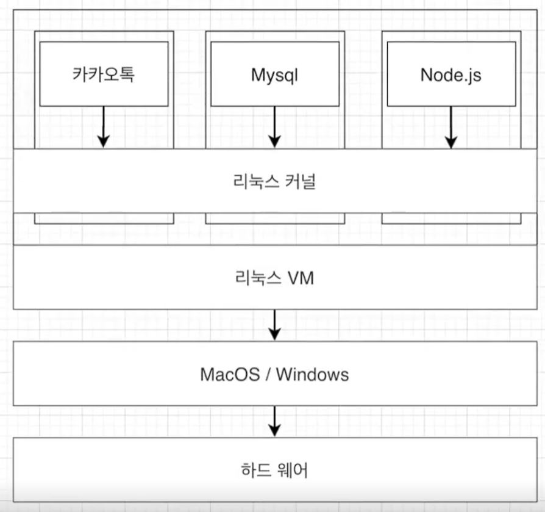

# 도커의 실행 환경

- 

- 도커는 리눅스에서 사용하는 C Group과 네임스페이스 기능을 사용하기 위해서 컨테이너들을 하나의 리눅스 VM에서 리눅스 커널을 공유하며 실행되게 합니다.

- 이것은 단순히 리눅스 기능을 사용하기 위한 것입니다.

- VM처럼 게스트 OS로부터의 리소스 할당이 아닌 리소스 자원은 그대로 호스트 OS인 윈도우나 맥으로부터 할당을 받으며 각 컨테이너는 호스트 OS의 커널을 공유합니다.

- <a href="https://docs.docker.com/desktop/vm-vdi/">도커 공식문서</a>

- 내부적으로 Docker Desktop은 Docker 엔진과 컨테이너를 실행하는 Linux VM을 사용하기 때문입니다.

- 이부분은 WSL2에 대한 내용을 생각해보면 이해할 수 있는 부분입니다. 도커는 리눅스 가상 환경을 필요로 합니다. 그 이유에 대한 설명이 이것입니다.

- VM과의 차이에 대한 부분은 호스트 OS와의 관계와 각 컨테이너가 VM처럼 하나의 OS를 가지지 않는 점을 주목해야 하는 것입니다. 도커가 컨테이너를 격리하고 자원을 할당하기 위해 리눅스 가상 환경을 필요로 하고 컨테이너들이 리눅스 커널을 공유하는 것 때문에 VM과 차이점이 없다고 볼 수는 없는 것입니다.

## WSL2

- 도커는 리눅스 환경에서 작동합니다. 윈도우 환경에서 리눅스 환경을 사용하기 위해서는 WSL2가 필요합니다.

- WSL2를 통해 도커를 사용하면 클라이언트는 윈도우 PowerShell에 명령어를 입력하지만 서버는 WSL2를 통해 우분투 리눅스 환경을 사용합니다.

- 설치에 대한 내용은 [도커 윈도우 10 Home 설치](https://www.lainyzine.com/ko/article/a-complete-guide-to-how-to-install-docker-desktop-on-windows-10/)
