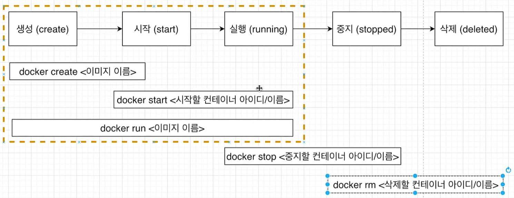

# 도커 컨테이너 생명 주기

- 

- `docker run`은 생성, 시작, 실행까지를 한번에 수행하는 명령어입니다.

- `docker create [이미지 이름]`과 `docker start [ID 혹은 이름]`으로 나누어서 사용할 수도 있습니다.

- 컨테이너가 실행되는 과정에서 파일 스냅샷이 컨테이너의 스토리지로 이동하는 것을 `docker create`라고 할 수 있습니다.

- 그리고 이미지가 가진 실행 명령어가 컨테이너에서 실행되는 것을 `docker start`라고 볼 수 있습니다.

## docker create

- `docker create [이미지 이름]`을 실행시키면 해당 이미지의 컨테이너가 생성이 되고 컨테이너의 ID가 반환됩니다.

## docker start

- `docker start -a [반환된 ID]`를 실행시키면 컨테이너를 실행시킬 수 있습니다.

- ID는 전부 붙여넣지 않더라도 실행이 됩니다.

- `-a`옵션은 attach를 의미하며 컨테이너가 실행이 될 때 컨테이너로부터 나오는 output들을 화면에 출력해주는 역할을 합니다.

## docker stop vs docker kill

- `docker stop`과 `docker kill`의 차이는 프로세스를 종료할 때 사용하는 시그널의 차이입니다. `docker stop`은 SIGTERM(15)을 사용하고 `docker kill`은 SIGKILL(9)을 사용합니다.
