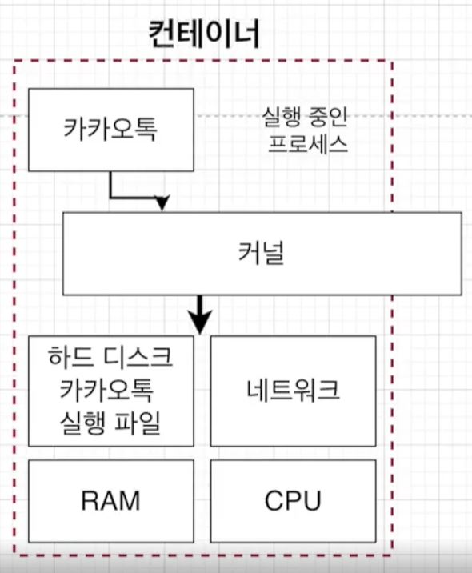

# 이미지로 컨테이너 만들기

- 이미지는 응용 프로그램을 실행하는 데 필요한 모든 것(코드, 실행 환경 등)을 가지고 있습니다.

- 실행하는 데 필요한 모든 것에는 시작시 실행 될 명령어와 파일 스냅샷이 있씁니다.

- 소프트웨어가 실행되기 위한 파일의 스냅샷과 그 파일 스냅샷의 실행을 위한 명령어를 이미지가 가지고 있는 것입니다.

- 파일 스냅샷은 디렉토리나 파일을 카피한 것을 의미합니다.

## 이미지가 컨테이너를 만드는 과정

- 도커 클라이언트에서 docker run image라는 명령어를 입력합니다.

- 도커 이미지 안에 있는 파일 스냅샷이 컨테이너에 할당된 스토리지에 옮겨집니다.

- 도커 이미지가 가지고 있는 run image라는 실행 명령어는 컨테이너가 명령어를 실행하는 부분으로 옮겨집니다.

- 

- 이미지로부터 컨테이너가 생성되고 컨테이너 내에서 애플리케이션이 실행이 되는 모습입니다.
