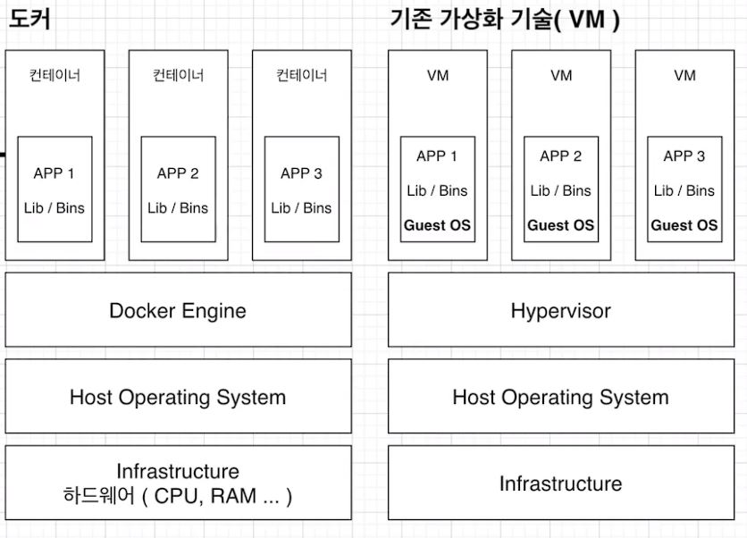

# 가상화 기술과 컨테이너

## 가상화 기술 도입 이전

- 가상화 기술이 도입되기 전에는 하나의 서버를 하나의 용도로만 사용했습니다.

- 100GB의 용량을 가지고 있고 80GB가 사용중이라면 남는 20GB는 방치되는 상황이 많았고 하나의 서버에 하나의 운영체제, 하나의 프로그램만을 운영했습니다.

- 안정적이지만 효율이 떨어진다고 할 수 있습니다.

## Hyper Visor 기반의 가상화 출현

- 서버 공간을 논리적으로 분할하여 각각을 Virtual Machine이라는 가상 환경의 서버로 이용할 수 있도록 할 수 있다면 효율적으로 하드웨어 자원을 활용할 수 있습니다.

- 하이퍼 바이저는 호스트 시스템에서 다수의 게스트 OS를 구동할 수 있게 해주는 소프트웨어입니다.

- 하드웨어 자원을 가상화하면서 각각의 VM들을 모니터링하는 중간 관리자 역할을 합니다.

## 네이티브 하이퍼 바이저

- 네이티브 하이퍼 바이저는 하이퍼 바이저 자신은 OS를 가지지 않고 하드웨어 드라이버를 통해 하드웨어를 직접 제어합니다.

- 자원을 효율적으로 사용할 수 있고 호스트 OS가 없으므로 오버헤드가 적습니다. 하지만 여러 하드웨어 드라이버를 설치해야 하므로 세팅이 어려운 점이 있습니다.

## 호스트형 하이퍼 바이저

- 호스트형 하이퍼 바이저는 일반적인 소프트웨어처럼 OS 위에서 실행됩니다.

- 하드웨어 자원을 VM 내부의 게스트 OS에 에뮬레이트 해주는 방식으로 자원을 관리합니다. 그로 인해 오버헤드가 큽니다.

- 하지만 게스트 OS의 종류에 대한 제약이 없고 구현이 네이티브 하이퍼 바이저보다 쉬운 장점이 있습니다. 일반적으로 하이퍼 바이저 기반의 가상화는 호스트형 하이퍼 바이저 방식으로 많이 사용됩니다.

## 하이퍼 바이저 기반의 VM 구조

- 

- 하이퍼 바이저에 의해 구동되는 VM은 각 VM 마다 독립된 가상 하드웨어 자원을 할당받습니다.

- 논리적으로 분리되어 있기 때문에 한 VM이 오류가 발생해도 다른 VM은 그 영향을 받지 않습니다.

## 도커 컨테이너 가상화 기술

- 

- 도커의 컨테이너 가상화 기술과 기존의 하이퍼 바이저 기반의 가상화 기술은 공통점을 가지고 있습니다.

- 두 기술 모두 애플리케이션에 격리된 환경을 할당해 배치한다는 공통점이 있습니다.

- 차이점은 컨테이너 방식은 게스트 OS를 두지 않고 애플리케이션을 호스트 OS에서 실행시킵니다. 하이퍼 바이저 기반의 VM은 게스트 자원을 할당해 게스트 OS를 부팅해서 애플리케이션을 실행해야 하기 때문에 컨테이너보다 실행 방식이 복잡하고 한 개체의 크기가 훨씬 큽니다.

## 컨테이너와 VM의 차이점

- 도커 컨테이너는 호스트 OS 그리고 다른 컨테이너와 동일한 커널을 공유합니다. 그렇기 때문에 컨테이너 내부에서 실행되는 프로세스는 호스트 OS에서도 확인이 가능합니다.

- 예를 들어, 컨테이너 내에서 몽고DB를 실행하면 몽고DB가 실행되는 프로세스를 OS에서 확인할 수 있다는 것입니다.

- VM은 호스트 시스템으로부터 자원을 할당받고 내부에는 게스트 OS가 독립된 채로 있기 때문에 독자적인 커널을 가지고 있습니다.

- 이것은 운영체제의 다양화를 이룰 수 있지만 크기가 크고 무겁기 때문에 속도의 저하가 일어날 수 있습니다.
