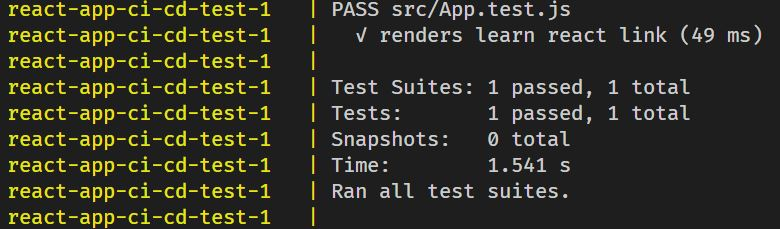

# 리액트 앱 CI/CD 구축

## 도커 파일의 분할

- 용도에 따라 서로 다른 도커 파일을 여러개 작성해서 사용할 수 있습니다. 예를들어 개발 단계에서 사용할 도커 파일을 작성하고 최종 배포를 하기 위해 사용할 도커 파일을 하나 더 작성할 수 있습니다.

## 개발 환경을 위한 도커 파일 Dockerfile.dev 빌드하기

- `docker build` 명령어는 파일명이 Dockerfile인 기본 도커 파일을 찾아서 빌드합니다. 용도에 맞게 파일명을 변경한 도커 파일을 사용해서 이미지를 빌드하려면 도커 빌드의 `-f`옵션을 사용해서 사용할 도커 파일을 명시해줘야 합니다. 사용법은 다음과 같습니다. `docker build -f [사용할 도커 파일명] [경로]`

## node:alpine

- alpine 리눅스 이미지를 베이스로 하는 node.js 이미지 중 하나입니다. alpine 이미지는 리눅스 배포판 이미지 중 가장 용량이 작습니다.

## 테스트를 위한 컨테이너 생성

- 배포를 하기 전 앱의 테스트를 진행하기 위해 테스트를 위한 컨테이너를 도커 컴포즈 파일에 명시해서 이미지의 빌드와 테스트를 동시에 진행할 수 있습니다.

- 

## 운영 환경을 위한 도커 파일 (멀티 스테이지 빌드)

- 서비스의 배포를 위해 별도로 웹 서버를 설치해서 사용하는 경우 build stage와 run stage를 나눠서 컨테이너를 구성할 수 있습니다.

- 이렇게 컨테이너를 구성하게 되면 빌드 스테이지에서 생성되었던 파일들은 빌드 디렉토리만 남긴 채로 삭제되고 런 스테이지의 웹 서버는 빌드된 결과물을 사용자에게 전달하므로 프로그램이 가벼워지는 장점이 있습니다.

- 런 스테이지에서 빌드 스테이지의 파일을 복사할 때는 `COPY --from=builder`로 빌드 스테이지에서 `as`를 사용해 명시한 별칭 builder를 명시해야 합니다. 그리고 빌드 디렉토리를 웹 서버의 디렉토리로 복사합니다.

- 빌드한 이미지를 컨테이너로 실행할 때 컨테이너에 대한 로컬 포트의 할당은 웹 서버가 기본적으로 사용하는 포트에 할당합니다. nginx 웹 서버의 기본 포트는 80번 포트이므로 `docker run -p 8080:80 [이미지 ID]`와 같이 사용할 수 있습니다.

## Travis CI

- Travis CI는 Github에서 진행되는 오픈소스 프로젝트로 Github 레포지토리에 있는 프로젝트의 CI/CD를 구축할 수 서비스입니다. 빌드, 테스트, 배포를 자동화시킬 수 있습니다.

## .travis.yml 파일 구조

- |     키워드     |                     의미                     |
  | :------------: | :------------------------------------------: |
  |      sudo      |         관리자 권한이 필요한 지 여부         |
  |    language    |         배포할 프로그램의 사용 언어          |
  |    services    |             도커 환경 사용 명시              |
  | before_install | 스크립트를 사용하기 전 필요한 명령들을 명시  |
  |    scripts     |            실행할 스크립트를 명시            |
  | after_success  | 스크립트 실행에 성공한 후 수행할 동작을 명시 |
  |     deploy     |           배포에 대한 항목을 명시            |

- | deploy 하위 키워드 |                 의미                 |
  | :----------------: | :----------------------------------: |
  |      provider      | 사용할 퍼블릭 클라우드 서비스를 명시 |
  |       region       |        AWS 서비스의 리전 명시        |
  |        app         |               앱 이름                |
  |        env         |  AWS elastic beanstalk 환경의 이름   |
  |    bucket_name     |            S3 버켓의 이름            |
  |    bucket_path     |     응용 프로그램의 이름과 동일      |
  |       branch       |           배포할 브랜치명            |
