# Docker container

- Docker community vs enterprise는 보안 컨설팅을 해주는지 아닌지의 차이이다.

- 도커 이전 LXC(Linux Container)가 존재했고 도커가 이후 개발되어 표준이 되었다. RKT(rocket)이라는 컨테이너 툴도 있다.

- `docker search [베이스 이미지명]` - docker hub에 원하는 이미지를 검색해서 출력한다. 우분투같은 os명일수도 있고 nginx같은 서비스가 설치된 이미지일 수도 있다.

- `docker search` 옵션 - `--no-trunc` - ID를 전체 길이로 출력하는 등 결과를 생략없이 모두 표시, `--limit` - 최대 검색 결과 수 제한, `--filter=stars=[N]` - star 수 N 이상으로 조건 명시

- `docker pull [베이스 이미지명:[태그명]]` - 태그에 버전을 명시해 원하는 버전을 명시해서 이미지를 불러올 수 있다. 명시하지 않으면 latest가 불러와진다. ex) nginx:1.19.10

- `docker image ls -q` - 이미지의 ID들만 출력한다.

- `docker inspect [이미지명]` - 이미지의 정보를 JSON 형태로 상세하게 출력한다.

- `docker insepct --format="{{[.알고싶은 값의 Key]}}" [이미지명]`

- ` docker inspect -f="{{.Id}}" nginx`

- ` docker inspect -f="{{.Config.AttachStdin}}" nginx`

- 와 같이 사용할 수 있다. 이 출력 값을 리디렉션해서 환경변수로 사용할 수도 있다.

- `docker container create -p [로컬 포트:컨테이너 포트] --name [지정할 컨테이너명] [이미지명]` - 으로 포트 맵핑을 해서 이미지를 기반으로 컨테이너를 생성할 수 있다.

- create하면 container ID가 출력된다.

- create만 하고 실행하지 않은 경우 `docker container ls -a`로 확인할 수 있다.

- `docker start [컨테이너명]`으로 실행시킬 수 있다.

- 실행된 컨테이너는 `docker container ls`로 포트 맵핑 등의 정보도 확인할 수 있다.

- `docker stop [컨테이너명]`으로 정지시킬 수 있다.

- 컨테이너가 정지된 상태라면 `docker rm [컨테이너명]`으로 컨테이너를 삭제할 수 있고 `-f` 옵션을 사용하면 실행중인 컨테이너도 삭제할 수 있다.

- `docker create -P [컨테이너명]`를 사용하면 이름과 포트를 지정하지 않고 컨테이너를 생성할 수 있으며 이후 start 하면 랜덤하게 로컬의 포트가 할당된다. 컨테이너 포트의 기본값은 80인 듯 하다.

- `docker run [이미지명[:태그명]]`으로 pull과 create와 start를 한번에 할 수 있다.

- `docker run [이미지명[:태그명]] [인자]`로 인자로 전달한 명령어를 실행해서 컨테이너 안에서 실행된 명령어의 결과를 컨테이너 밖으로 출력하도록 할 수 있다. `-p`옵션은 publish 옵션인데 그 옵션을 부여하지 않았으므로 이 컨테이너는 인자로 전달받은 명령을 수행하고 종료된다.

- 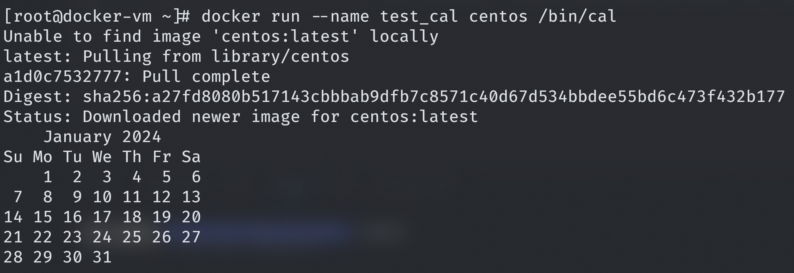

- `docker run -d --name test_ping centos /bin/ping localhost`와 같이 detach 옵션을 사용해 컨테이너를 백그라운드로 실행되도록 할 수 있다.

- 위 컨테이너는 핑을 계속 보내는데 그 내용을 확인하려면 `docker logs -t [컨테이너명]`을 사용해서 출력값을 확인할 수 있다. `-t`옵션은 트래픽 발생 시간을 포함해서 출력하는 옵션이다.

- `docker stats [컨테이너명]`은 모니터링 명령어로 CPU, MEM USAGE, MEM %, NET I/O, BLOCK I/O 등의 사용량을 확인할 수 있다. 나올때는 ctrl+c로 나온다.

- nginx 컨테이너를 배포하고 stats 명령을 수행한 다음 웹으로 접속해 새로고침을 반복하면 CPU, NET I/O 정보가 실시간으로 변하는 것을 확인할 수 있다.

- 위 nginx 컨테이너에 logs를 사용하면 웹서버에 접속한 로그를 모두 확인할 수 있다. 로그에는 사용자의 브라우저 정보 등 여러 정보가 들어있다. 다른 브라우저로 접속하면 다른 로그가 발생하는 것을 확인할 수 있다.

- 컨테이너에 할당할 리소스를 지정해줄 수 있는데 `docker run -d -p 8181:80 --cpus 1 --memory 256m --name test_resource nginx`와 같이 cpu 코어 수와 메모리 크기를 지정해줄 수 있다.

- 이렇게 생성하고 실행시킨 컨테이너를 stats로 살펴보면 mem limit이 256MB로 되어있는 것을 확인할 수 있다.

- cpu 할당은 `--cpu-shares`옵션도 있는데 값으로는 1024, 2048과 같이 주는데 1024가 cpu 1코어를 의미하며 `docker run -d -p 8334:80 --cpu-shares 512 --memory 256m --name test_resource2 nginx`와 같이 반 코어를 할당할 수도 있다.

- `docker inspect -f "{{.HostConfig.CpuShares}}" test_resource2`로 512로 할당된 것을 확인할 수 있다.

- 도커 볼륨 실습은 ` docker run -d -p 8551:80 --cpu-shares 512 --memory 64m -v /tmp:/usr/share/nginx/html --name test_resource3 nginx`로 tmp 폴더를 nginx의 홈 디렉토리에 마운트한 다음 tmp에 웹페이지를 배포해서 컨테이너의 nginx에 접속(8551포트)해서 확인한다.

- AWS EFS 같은 NFS를 도커 볼륨으로 컨테이너들에 마운트시켜서 서로 파일을 공유하도록 할 수도 있다.

- `docker container ls -a --filter name=test`로 test가 이름에 들어가는 컨테이너만 목록을 출력할 수도 있다.

- `docker container ls --format "table{{.Names}}\t{{.Status}}"`와 같이 ls를 했을 때 출력되는 테이블의 컬럼을 정해서 출력할 수도 있다.

- 컨테이너에 접속하는 명령어는 `docker container attach`인데 exit를 하면 컨테이너가 종료되므로 ctrl+p, q로 접속을 해제해야 한다. 컨테이너에서 프로세스를 실행하도록 하는 명령어인 `docker container exec -it [컨테이너명] /bin/bash`로 표준 입력을 연결하고 tty를 하겠다는 `-it` 옵션을 주고 bash를 실행하도록 해서 접속하면 exit를 해도 새로 실행한 bash 프로세스가 종료되는 것이므로 컨테이너는 종료되지 않는다.

- `docker container top [컨테이너명]`으로 컨테이너 안에서 실행중인 프로세스들을 확인할 수 있다.

- `docker container port [컨테이너명]`으로 연결된 포트를 확인할 수 있다.

- `docker container rename [컨테이너명] [바꿀 컨테이너명]`으로 컨테이너 이름을 바꿀 수 있다.

- `docker container cp [컨테이너명:[전달할 파일의 경로]] [전달받을 내 로컬의 경로]`로 컨테이너 안에 있는 파일을 복사해올 수 있다.

- `docker container cp [전달할 로컬 파일의 경로] [컨테이너명:[전달받을 경로]]`로 내 로컬의 파일을 컨테이너로 복사할 수 있다. 이미 그 자리에 파일이 있는 경우 덮어씌워진다.

- `docker container cp [/directory] [컨테이너명:[경로]]`로 컨테이너의 경로 하에 내 로컬의 디렉토리를 그대로 덮어씌울 수 있다. /usr/share에 내 로컬에 html 디렉토리를 미리 구성해둔 다음 cp하면 /usr/share/html이 내가 구성한 디렉토리로 복사된다.

- `docker container diff [컨테이너명]` 원본 이미지와 달라진 점을 출력하는 명령어이다. 추가된 파일 목록, 삭제된 파일 목록 등을 확인할 수 있다.

- `docker container commit -a "[저자명]" -m "[코멘트]" 컨테이너명 [생성할 이미지 이름:[태그명(버전명)]]`으로 컨테이너를 이미지로 만들 수 있다. 저자명은 github처럼 이름<이메일>같은 형태로 작성할 수 있는 듯 하다. 코멘트는 이미지에 대한 추가 설명

- 도커 볼륨을 사용중일 때는 docker commit이 되지 않는다고 한다.

- 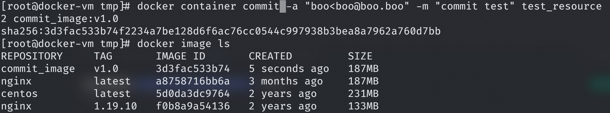

- centos 도커 설치

```bash
curl -fsSL https://get.docker.com/ | sh
yum -y install bash-completion wget unzip mysql
curl https://raw.githubusercontent.com/docker/docker-ce/master/components/cli/contrib/completion/bash/docker -o /etc/bash_completion.d/docker.sh
systemctl enable --now docker
```

- ubuntu 도커 설치 마지막 명령어는 일반 사용자를 도커 그룹에 넣어서 sudo 없이 도커 사용

```bash
sudo apt update
sudo apt install apt-transport-https ca-certificates curl software-properties-common -y
sudo curl -fsSL https://download.docker.com/linux/ubuntu/gpg | sudo apt-key add -
###$ sudo add-apt-repository "deb [arch=amd64] https://download.docker.com/linux/ubuntu bionic stable" # 우분투 18.04
sudo add-apt-repository "deb [arch=amd64] https://download.docker.com/linux/ubuntu xenial stable" # 우분투 16.04
sudo apt update
sudo apt-cache policy docker-ce
sudo apt install docker-ce -y
sudo usermod -a -G docker boo
```

- `docker run --rm --name test_cal_rm centos /bin/cal` - 임시 컨테이너가 명령만 실행하고 바로 사라지게 할 수 있다.

# Docker Hub, Private Image Registry

- `docker image save -o [지정할 tar 파일명.tar] [이미지명:[태그]]` - 이미지 tar파일로 저장, 이미지 저장소의 다원화 목적

- `docker image load -i [tar 파일명]` - tar 파일을 기반으로 이미지를 생성한다.

- 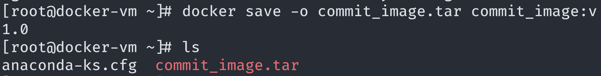

- 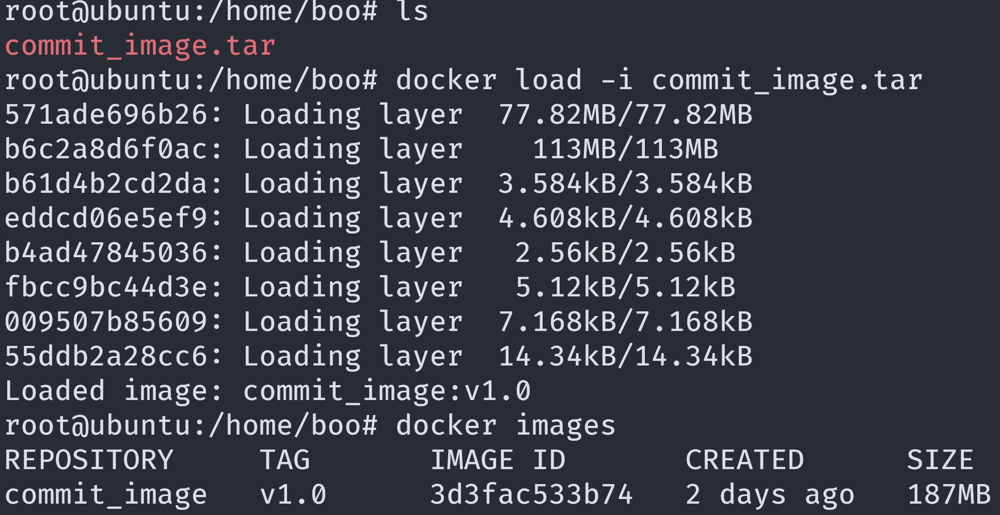

# Docker Network

- docker0이 eth0과 다른 컨테이너들의 veth들을 연결하는 vRouter의 역할을 하고 NAT의 기능을 해서 외부와 컨테이너들이 통신할 수 있게 해준다.

- veth는 클라이언트에서 컨테이너에 할당하는 인터페이스인데 컨테이너 내부에선 eth0이라는 인터페이스와 서로 연결되어 있다. 서로 연결되어 있는 것의 확인은 인터페이스 뒤에 @if[번호]로 확인할 수 있다. `5. vetho@if4` 와 `4. eth0@if5` 라면 인터페이스 번호를 통해 서로 참조하고 있는 것을 알 수 있다.

- 데비안 계열 컨테이너에서 `ip a` 명령어가 없는 경우 `apt install iproute2`를 설치하면 된다. `iputils_ping`은 ping

- 서로 다른 컨테이너는 같은 네트워크 대역에 존재하는 것과 같으며 서로 내부 eth0의 ip를 통해 통신이 가능하다.

- 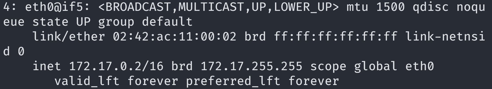

- 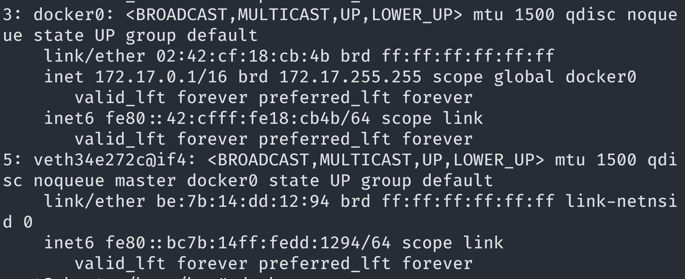

- `docker network ls` 명령어로 도커와 관련된 네트워크의 목록을 출력할 수 있다.

- 기본 네트워크 중 이름이 bridge인 네트워크가 있으며 `docker inspect bridge`로 bridge의 역할을 하는 하는 네트워크 인터페이스가 무엇인지 확인할 수 있다.

- docker0은 브릿지 네트워크로 로컬의 eth0에 의존하며 컨테이너들에 NAT 기능을 제공하는 것을 확인할 수 있다.

- `docker network create` 명령어로 네트워크 인터페이스를 생성할 수 있다.

- `-d` 옵션으로 네트워크 드라이버를 지정할 수 있다.

- `--subnet`, `--ip-range` 옵션으로 네트워크 대역을 정해서 생성할 수 있다.

- `docker network create -d bridge --subnet 10.190.0.0/16 --ip-range 10.190.0.0/20 test_bridge`

- `-d` 옵션을 주지 않을 경우 네트워크의 default 타입은 bridge이다.

- `--gateway 10.190.0.1` 옵션을 추가해서 게이트웨이의 ip를 직접 정해줄 수도 있다.

- `docker network rm [네트워크 인터페이스명]`으로 삭제가 가능하다.

- `docker network connect [네트워크명] [컨테이너명]`으로 컨테이너가 실행중이여도 다른 네트워크 영역을 변경할 수 있다. inspect로 확인이 가능하다.

- `docker network disconnect [네트워크명] [컨테이너명]`로 다시 default인 docker0으로 되돌릴 수도 있다.

- 서로 다른 브릿지에 연결된 컨테이너는 통신이 되지 않는다. 통신이 가능하게 하려면 같은 네트워크를 연결해야 한다.

- 컨테이너에 복수의 브릿지 네트워크 연결이 가능하며 한 컨테이너는 docker0 + test, 하나는 test여도 test 브릿지를 통해 통신이 가능하다.

- 호스트 네임을 통한 통신은 기본 docker0은 제공하지 않으며 직접 생성한 네트워크에서만 가능하다. 호스트네임뿐만 아니라 컨테이너명을 통한 통신도 가능하다.

- `ping webserver`, `ping test_bash`로 서로 통신이 가능한 것이다.

- 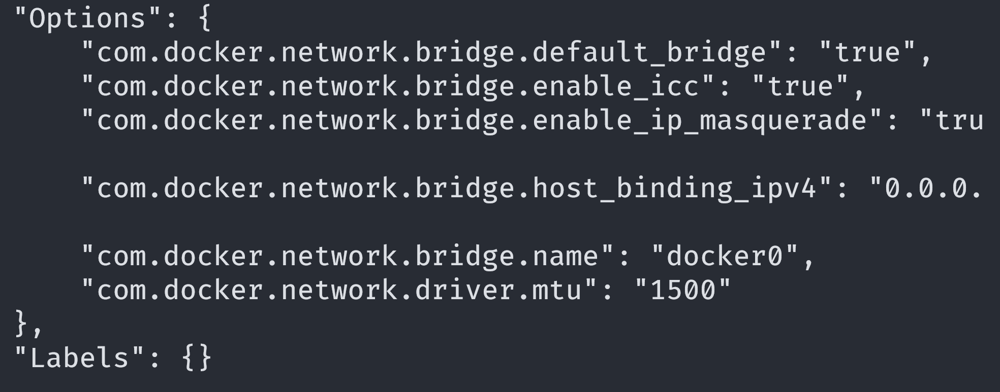

- `docker run`을 할때 `--network [네트워크명]`으로 처음부터 네트워크를 지정해줄 수 있다.

# Docker Update

- 컨테이너의 정보를 갱신하고 업데이트하는 명령어인데 리소스를 재할당할 수 있고(`--cpu-shares`, `--memory`) 재시작 옵션으로 재시작할 수 있다.

# Docker System

- `docker system df`로 전체 이미지 중 사용중인 이미지, 전체 컨테이너 중 실행중인 컨테이너, 볼륨 수와 실행중인 볼륨 수를 확인할 수 있다.

- `docker system info`로 도커 호스트(VM, 인스턴스)의 정보와 도커 버전, 스웜 사용 여부 등을 확인할 수 있다.

- 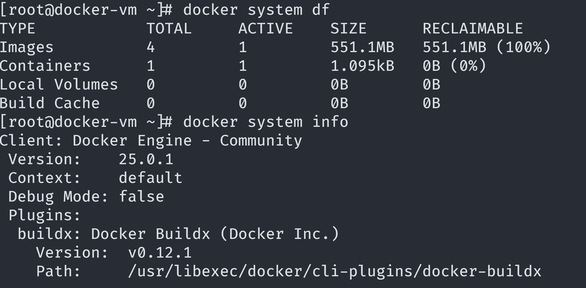

- `docker image/container prune` - 사용하지 않는 컨테이너나 이미지를 일괄 삭제할 수 있다. 컨테이너는 Up되지 않은 모든 컨테이너가 삭제되고 이미지는 사용하지 않더라도 삭제되지는 않는다.

# 컨테이너간 연동

- wordpress와 db컨테이너를 각각 생성해서 서로 연동시킨다.

- 컨테이너를 pull해서 db 서버를 구성할 수 있는데  
   `docker run -d -p 3306:3306 --name dbserver \
-e MYSQL_DATABASE=wordpress \
-e MYSQL_USER=wpuser \
-e MYSQL_PASSWORD=Test1752! \
-e MYSQL_ROOT_PASSWORD=Test1752! \
--network test_bridge mariadb`

- docker hub에서 해당 이미지에 대한 상세 설명에서 `-e` 옵션으로 환경 변수를 설정하여 전달했을때 구성이 자동으로 될 수 있는 항목을 확인할 수 있다. 위 DB 컨테이너는 생성할 db명, 유저명, 패스워드 등을 기입해서 자동화를 할 수 있다.

- `docker run -d -p 80:80 --name webserver \
-e WORDPRESS_DB_HOST=dbserver \
-e WORDPRESS_DB_NAME=wordpress \
-e WORDPRESS_DB_USER=wpuser \
-e WORDPRESS_DB_PASSWORD=Test1752! \
--network test_bridge wordpress:4.8.2`

- wordpress도 동일하다. 초기 실행때 DB 연동을 위해 기입할 목록을 미리 기입할 수 있다. 그리고 두 컨테이너는 같은 네트워크에 있으므로 호스트네임으로 컨테이너명을 줄 수 있다.

- 같은 네트워크에 있지 않은 경우 도커 호스트의 ip로 연동이 가능하다.

- 80번 포트로 wordpress로 접속하면 DB 연동 설정 화면은 생략되고 언어 선택 후 wordpress admin 설정만 하면 되는 것을 확인할 수 있다.

## 도커 볼륨

- 위 마리아db 이미지는 자동으로 도커 호스트 로컬에 볼륨을 생성해서 마운트하는데 그 볼륨에 모든 정보(댓글, 게시글 등)가 저장된다.

- `docker volume create wpdb-vol`로 볼륨을 직접 생성해서 `-v` 옵션을 추가해 `wpdb-vol:/var/lib/mysql`을 하면 직접 볼륨을 관리할 수 있다.

- wordpress 이미지도 동일하게 wordpress를 설치했을때 webserver의 홈 디렉토리에 있는 php 파일들을 볼륨을 생성해서 그 안에 둔다.

```bash
docker run -d -p 3306:3306 --name dbserver -e MYSQL_DATABASE=wordpress -e MYSQL_USER=wpuser -e MYSQL_PASSWORD=Test1752! -e MYSQL_ROOT_PASSWORD=Test1752! -v wpdb-vol:/var/lib/mysql --network test_bridge mariadb

docker run -d -p 80:80 --name webserver -e WORDPRESS_DB_HOST=dbserver -e WORDPRESS_DB_NAME=wordpress -e WORDPRESS_DB_USER=wpuser -e WORDPRESS_DB_PASSWORD=Test1752! -v wpweb-vol:/var/www/html --network test_bridge wordpress
```

- 볼륨을 따로 생성하지 않더라도 위와 같이 명시하면 그 볼륨이 생성되면서 마운트된다.

- 볼륨이 유지가 된다면 새로 컨테이너를 실행해도 그 볼륨을 마운트하면 이전 DB 컨테이너에 저장된 내용이 유지된다.

# Dockerfile

```dockerfile
FROM ubuntu:18.04
MAINTAINER boo
LABEL "name"="webserver"
ENV aloha=date
ENV path=/var/www/html
RUN sed -i 's/archive.ubuntu.com/ftp.daumkakao.com/g' /etc/apt/sources.list
RUN apt-get update
RUN apt-get install apache2 -y
COPY nihao /var/www/html/nihao
COPY hello.html $path
ADD aws.tar $path
WORKDIR $path
RUN echo "<h1>ohayo</h1>" > ohayo.html
VOLUME $path
EXPOSE 80
ENTRYPOINT ["apachectl"]
CMD ["-D", "FOREGROUND"]
```

- FROM - 베이스 이미지, 내가 만든 이미지도 베이스 이미지가 될 수 있다.

- MAINTAINER - 작성자

- RUN - 명령어 실행

- LABEL - 라벨 설정, 위와 같이 name 항목에 컨테이너명을 줄 수 있다.

- COPY - 호스트의 파일이나 디렉토리를 지정한 컨테이너 내의 경로로 복사한다.

- ADD - ADD도 호스트의 파일을 복사할 수 있고 tar 파일의 경우 목적지 경로에 자동 압축 해제가 된다. URL을 줄 경우 wget을 통해 목적 경로에 다운로드도 가능하다.

- EXPOSE - 컨테이너의 포트를 결정한다. `-P` 옵션으로 포트를 지정하지 않았을 때 컨테이너의 default 포트가 된다.

- WORKDIR - 컨테이너의 워크디렉토리를 지정한다. exec으로 접속하면 진입점이 워크디렉토리이다.

- ENV - 컨테이너에서 사용할 환경변수를 지정해준다.

- VOLUME - 볼륨을 마운트한다. 위의 경우 컨테이너의 경로만 명시되어 있으며 위 db 이미지 불러오기처럼 호스트에 자동으로 볼륨이 생성된다.

- ENTRYPOINT, CMD - 반드시 실행되어야 하는 명령어를 입력한다. 띄어쓰기를 `,`로 구분하고 변경 불가한 필수 부분이 ENTRYPOINT이고 변경 가능한 부분을 CMD에 작성한다. 이 부분은 컨테이너에 시작할때 수행할 특정 명령을 덧붙여서 실행할때와 같다.

- `docker build -t sesac:aws .` - `.`은 경로로 Dockerfile이 있는 경로를 명시한다.

## DB 컨테이너 빌드

- my.cnf 파일을 미리 생성하여 mariadb의 구성을 자동화할 수 있다.

- 그것 뿐만 아니라 RUN을 활용해서 DB의 생성이나 계정 생성 및 권한 부여도 자동화할 수 있다.

```dockerfile
FROM ubuntu:20.04
ENV DEBIAN_FRONTEND noninteractive
# apt install 시에, 발생할 수 있는 예를들어 '패키시 설치 정말 하겠습니까?', '비밀번호 입력햇주세요'같은거를 무시하고 진행할 수 있다고 한다.
ENV MYSQL_ROOT_PASSWORD=Test1752!
ENV MYSQL_DATABASE=wordpress
ENV MYSQL_USER=wpuser
ENV MYSQL_PASSWORD=Test1752!
RUN sed -i 's/archive.ubuntu.com/ftp.daumkakao.com/g' /etc/apt/sources.list
RUN apt-get update && \
    apt-get install -y mariadb-server
RUN service mysql start && \
    mysql -u root -p${MYSQL_ROOT_PASSWORD} -e "CREATE DATABASE ${MYSQL_DATABASE};" && \
    mysql -u root -p${MYSQL_ROOT_PASSWORD} -e "CREATE USER '${MYSQL_USER}'@'%' IDENTIFIED BY '${MYSQL_PASSWORD}';" && \
    mysql -u root -p${MYSQL_ROOT_PASSWORD} -e "GRANT ALL PRIVILEGES ON ${MYSQL_DATABASE}.* TO '${MYSQL_USER}'@'%';" && \
    mysql -u root -p${MYSQL_ROOT_PASSWORD} -e "FLUSH PRIVILEGES;" && \
    service mysql stop
COPY my.cnf /etc/mysql/my.cnf
EXPOSE 3306
CMD ["mysqld_safe"]
```

- `docker build -t wp-db:v1.0 -f Dockerfile.wp-db .`

- 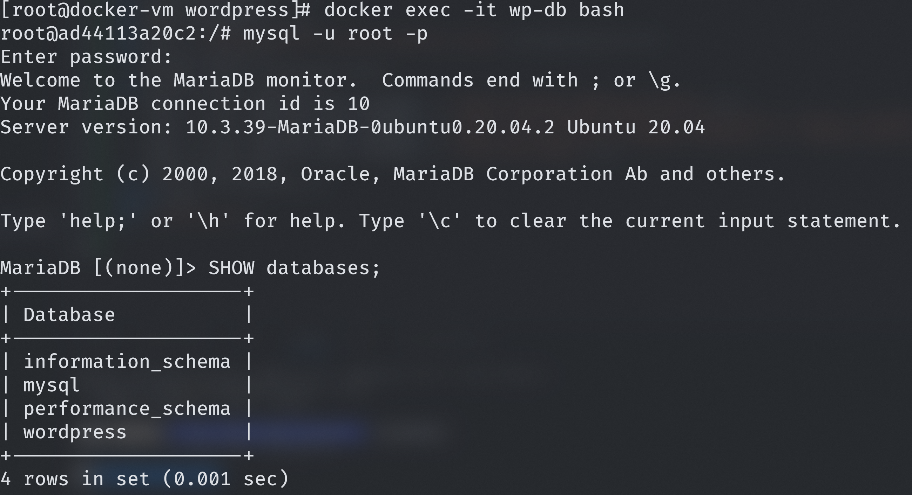

- DB 생성이 자동화된 것을 확인할 수 있다.

## wordpress WS 컨테이너 빌드

```dockerfile
FROM centos:7
MAINTAINER boo
RUN yum -y install https://rpms.remirepo.net/enterprise/remi-release-7.rpm && \
    yum -y install epel-release yum-utils && \
    yum-config-manager --enable remi-php74 && \
    yum -y install httpd php php-mysqlnd wget unzip
RUN wget https://ko.wordpress.org/latest-ko_KR.zip
WORKDIR /var/www/html
RUN unzip /latest-ko_KR.zip
RUN mv wordpress/* .
RUN chown -R apache:apache /var/www
ENTRYPOINT ["httpd", "-D", "FOREGROUND"]
```

- `docker build -t wp-web:v1.0 -f Dockerfile.wp-web .`

- 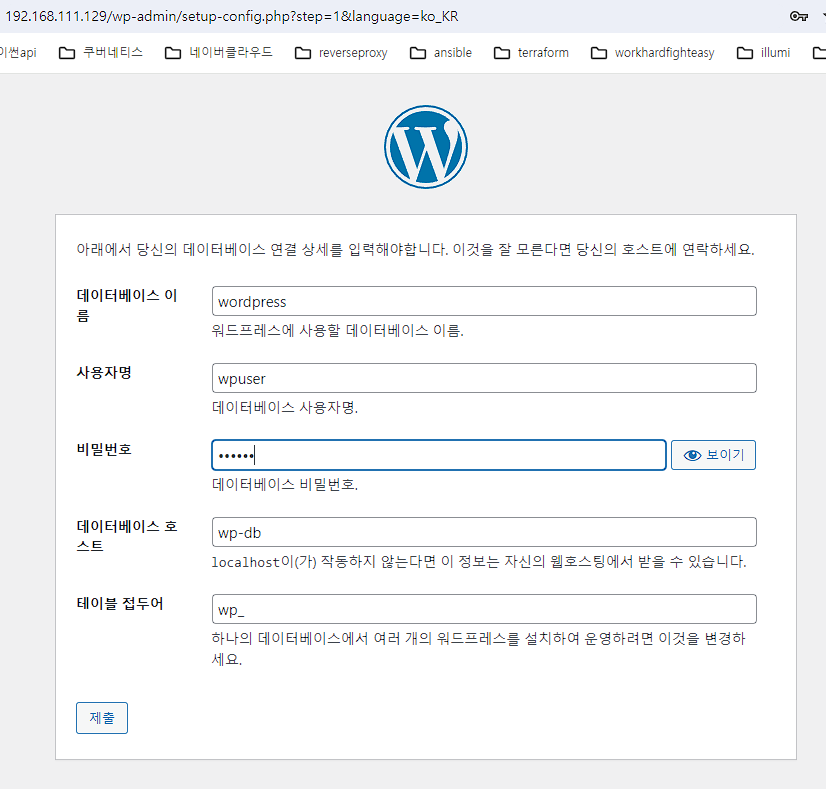

- db 호스트로 컨테이너명을 기입해서 db를 연동한다.

- 위 도커파일들의 엔트리 포인트에 httpd와 mysql_safe는 아파치 ws나 mysql 서버가 bin 명령으로도 실행이 가능한 듯 하고 그 실행을 의미하는 것으로 보인다.

# Bind Mount vs Volume

- `-v` 옵션으로 호스트의 디렉토리를 마운트할 수 있고 볼륨을 생성하면서 연결할 수 있다. 둘은 서로 다른 개념이다. 볼륨은 도커에 의해 관리된다.

- 볼륨을 마운트할때 컨테이너 안에서 디렉토리의 권한을 설정할 수 있다. `-v [볼륨명 혹은 로컬 디렉토리 경로]:[컨테이너 경로]:[권한]` 권한 예시 - read only는 :ro

- 하나의 볼륨을 복수의 컨테이너에 마운트할 수 있고 그것은 컨테이너간 공유 파일시스템처럼 동작한다.

# docker hub에 이미지 PUSH

- `docker tag [이미지명:태그] [내 docker hub ID]/[이미지명:태그]`로 이미지에 태그를 달아둔다.

- 내 docker hub 아이디로 로그인하기 위해 `docker login` 명령어를 사용한다. `-u, -p` 옵션으로 ID와 비밀번호를 줄 수도 있고 그냥 사용하면 직접 입력한다.

- `docker push [이미지명]`으로 docker hub에 이미지를 push할 수 있고 도커 허브에 접속해서 레포지토리에서 확인할 수 있다.

- 태그만 다른 이미지라면 도커 허브에서 같은 레포지토리에 저장된다.

- push한 이미지는 바로 run 명령을 통해 pull하면서 실행시킬 수 있다.

- 이미지 레포지토리가 private이라면 pull을 할때도 docker login이 필요하다.

# ONBUILD

- ONBUILD는 ONBUILD에 명시한 내용을 제외한 채로 이미지를 빌드하게 한다.

- 뭐 강의에서는 운영과 개발을 나눠서 도커를 모르는 개발자를 위해 사용한다고 하는데 이런 의의는 좋지만 자꾸 개발 운영 갈라치기하고 그러는거 보기 안좋네 누가 운영을 비하를 했나 뭘했나 요즘 도커 못하는 백엔드 개발자가 어디있나... 왜 부트캠프 강사들은 자기 포지션에 대한 이야기를 이렇게 하기를 좋아할까? 프론트도 똑같고

```dockerfile
FROM ubuntu:18.04
RUN sed -i 's/archive.ubuntu.com/ftp.daumkakao.com/g' /etc/apt/sources.list
RUN apt-get -y update
RUN apt-get -y install nginx
EXPOSE 80
ONBUILD ADD website*.tar /var/www/html/
CMD ["nginx", "-g", "daemon off;"]
```

```dockerfile
FROM boooo0/web-base:v1.0
```

- 이렇게 pull하는 쪽에서 베이스 이미지로 명시하고 pull해서 실행하면 ONBUILD 이하의 내용은 그때 실행된다.

- tar 파일을 준비한 상태에서 `docker build -t boooo0/web-site:v1.0 .`로 ONBUILD 이하의 내용을 완성해 빌드한 후 다시 push한다.

- 운영쪽에서 완성된 이미지를 확인한다. `docker run -d -p 80:80 --name=test-site boooo0/web-site:v1.0`

# 사설 레지스트리

- docker hub의 대안으로 사설 레지스트리를 생성할 수 있다.

- 강의에서는 GCP에 인스턴스를 생성해서 진행했다.

- gcp 네트워크는 aws vpc와 다르다. 서브넷을 지역에 생성하고 그 안에 vm을 생성한다.

- Compute Engine 탭에서 메타 데이터 항목을 선택하고 내 로컬의 SSH 퍼블릭 키를 기입한다.

- private key를 사용해서 ssh 접속을 할 수 있다. 이건 모든 인스턴스에 적용된다.

- `docker run -d -p 5000:5000 --restart=always --name private-docker-registry registry`로 registry 이미지를 pull해서 실행한다.

- push 혹은 pull을 진행할 서버에서 /etc/docker/daemon.json 파일에 { "insecure-registries":["[내 사설 도커 레지스트리의 주소:포트]"] }를 입력하고 도커 서비스를 재시작한다. 사설 레지스트리 서버에 대한 허용의 의미인 듯 하다.

- ` docker tag sesac:aws [내 사설 도커 레지스트리의 주소:포트]/sesac:aws` `docker push [내 사설 도커 레지스트리의 주소:포트]/sesac:aws`로 사설 레지스트리에 push하고 등록된 이미지를 pull할 수도 있다.

- 사설 레지스트리에 등록된 레포지토리 목록은 `http://[사설 레지스트리 주소:포트]/v2/_catalog`에서 호출되는 JSON 데이터로 확인이 가능하다.

- 혹은 `curl -X GET [사설 레지스트리 주소:포트]/v2/_catalog`

- `curl -X GET [사설 레지스트리 주소:포트]/v2/[이미지 이름]/tags/list`로 태그 리스트도 조회가 가능하다.

# docker compose

- 복수의 컨테이너를 yaml로 정의해서 실행시키기 위한 방식, 하나의 컨테이너여도 yaml로 선언적으로 작성하는 장점이 있는 듯 하다.

```yml
version: "3.3"
services:
  dbserver:
    image: mysql:5.7
    volumes:
      - db_data:/var/lib/mysql
    restart: always
    environment: # -e
      MYSQL_ROOT_PASSWORD: password
      MYSQL_DATABASE: wordpress
      MYSQL_USER: wpuser
      MYSQL_PASSWORD: wppass
  wordpress:
    depends_on:
      - dbserver # wordpress 컨테이너 실행에 앞서서 dbserver을 실행
    image: wordpress:latest
    volumes:
      - wordpress_data:/var/www/html
    ports: # -p 80:80
      - "8888:80"
    restart: always
    environment:
      WORDPRESS_DB_HOST: dbserver:3306
      WORDPRESS_DB_USER: wpuser
      WORDPRESS_DB_PASSWORD: wppass
      WORDPRESS_DB_NAME: wordpress
volumes:
  db_data: {}
  wordpress_data: {}
```

- 이번에도 DB가 연동된 상태로 wordpress가 실행된다.

- 네트워크는 따로 정의되지 않았지만 dockercompose_default라는 이름으로 브릿지 네트워크가 생성된다. docker compose로 생성되는 컨테이너는 서로 같은 네트워크에 묶이는 것이 기본값으로 보인다.

- 도커 컴포즈에서 컨테이너명은 yaml에서 정의한 서비스명이다. 실제 컨테이너명은 다르고 컨테이너 명령어를 사용할때는 실제 컨테이너명을 써야 한다.

- `docker compose up -d`로 실행 `-d`는 컨테이너를 데몬으로 실행

- `docker compose pause`, `docker compose unpause`로 일괄 정지, 재시작이 가능하다.

- `docker compose port [서비스명] [포트]` - 컨테이너 포트와 맵핑된 로컬 포트 출력

- `docker compose config` - 정의한 yaml 파일 기반의 정보 출력

- `docker compose stop wordpress`, `docker compose rm wordpress`

- `docker-compose down` - 컨테이너 삭제, `-v` 옵션주면 볼륨, `--rmi all`하면 이미지도 모두 삭제, 네트워크는 첫 down 시에 삭제인 듯 하다.

- dry run - `docker compose config`로 출력된 정보를 그대로 yml파일로 생성한 다음 그 내용을 기반으로 docker compose를 실행

# cAdvisor

- 호스트의 정보를 통해 컨테이너를 모니터링한다.

```bash
docker run \
  --volume=/:/rootfs:ro \
  --volume=/var/run:/var/run:ro \
  --volume=/sys:/sys:ro \
  --volume=/var/lib/docker/:/var/lib/docker:ro \
  --volume=/dev/disk/:/dev/disk:ro \
  --publish=8080:8080 \
  --detach=true \
  --name=cadvisor \
  --privileged \
  --device=/dev/kmsg \
  gcr.io/cadvisor/cadvisor:$VERSION
```

- Bind Mount로 도커 호스트의 디렉토리를 마운트한다.

- privileged 일반적으로 생성되는 Container는 Host에서 독립된 Linux namespace 영역을 가지고 있어서 Host 시스템의 주요자원에 접근할 수 있는 권한이 없습니다. 하지만 다양한 종류의 Kubernetes Addon 들이 동작하는 것을 보면 각 Addon 역할을 수행하는 Pod의 Container가 생성되며 생성된 Container가 Host의 자원에 접근하여 동작하는 경우를 볼 수 있습니다. 이렇게 Container 임에도 불구하고 Host 시스템의 주요 자원에 접근할 수 있는 Container가 바로 Privileged Container 입니다.

- 이유는 위와 같다.

- 기본적으로는 호스트의 사용량 정보이고 containers에서 컨테이너를 선택해서 모니터링할 수 있다.

- 위의 wordpress에 접속해서 새로고침을 여러번 반복하면 그 컨테이너의 cpu, memory, network throughput이 올라가는 것을 확인할 수 있다.

- 컨테이너에 할당된 리소스도 나오는데 docker update로 해당 부분을 변경하면 바로 반영이 된다.

- 다른 정보들은 docker top, docker stats의 정보와 유사하다.

# Docker Swarm

- docker에서 기본으로 제공하는 컨테이너 오케스트레이션 기능, 컨테이너 클러스터를 구성한다. 중소규모의 컨테이너를 제어하기에 알맞다.

- 마스터 VM이 있고 VM 하나에 TASK가 있고 그 안에 컨테이너가 있다. Node가 VM, Pod가 TASK? TASK가 노드고 컨테이너가 Pod가 맞는 것 같은데

- TASK라는 단위 안에 컨테이너가 동작하는건 맞는데 컨테이너 자체를 의미하는 pod와 다른가? 아무튼 TASK가 가장 작은 단위이다. 그냥 설명이 이상했음 pod == task

- 마스터 VM에 `docker swarm init --advertise-addr 192.168.111.131`로 자신의 IP를 입력해서 도커 스웜 클러스터의 마스터 노드임을 선언한다.

- 출력되는 토큰 정보를 넣어서 `docker swarm join --token SWMTKN-1-1rnw2s7wvhvfaceg6oljbg5b9bo44ecqtovk1rpdnyuhbfxhaw-exfdg3ue3vi4o6cv1cv61766u 192.168.111.131:2377`를 워커 노드에 실행시켜서 워커 노드로 편입시킨다.

- 마스터의 2377포트가 열려있어야 한다.

- `docker node ls`로 노드 목록을 확인할 수 있다.

- `docker node inspect [노드명]`으로 노드의 정보를 확인할 수 있다.

- `docker service create --name my_web --replicas 3 --publish published=8080,target=80 nginx` - my_web이라는 서비스를 생성할 것인데 3개 만들어서 8080:80으로 맵핑, 베이스 이미지는 nginx를 pull해서

- 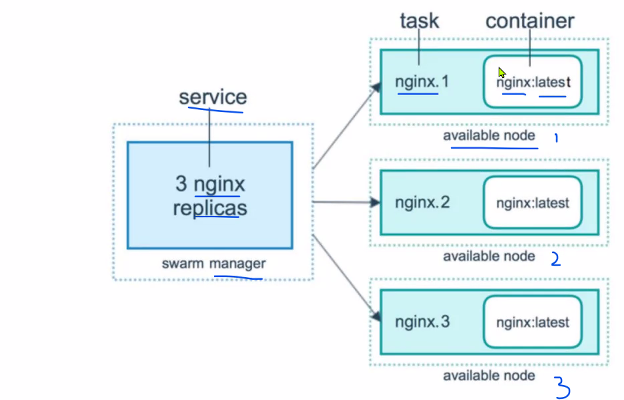

- `docker service ls`로 서비스 목록 확인 가능하다. 모든 서비스 명령어는 마스터 노드만 사용할 수 있다.

- `docker service logs my_web`로 서비스의 로그 확인이 가능하다.

- `docker service scale my_web=5`로 TASK의 수를 조정할 수 있다. 각 TASK는 적절히 노드에 나눠진다.(스케줄링)

- 스케일을 맞추기 위해 만약 컨테이너 하나가 강제로 종료되면 그 기록이 남고 새로 컨테이너를 생성한다.

- 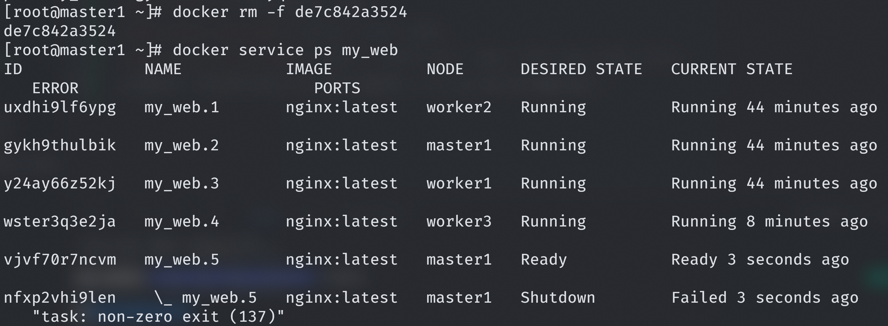

- VM이 다운되었을 것을 가정해서 VM을 하나 내리면 스케일을 유지하기 위해 다른 노드에서 새로 컨테이너를 실행시킨다.

- 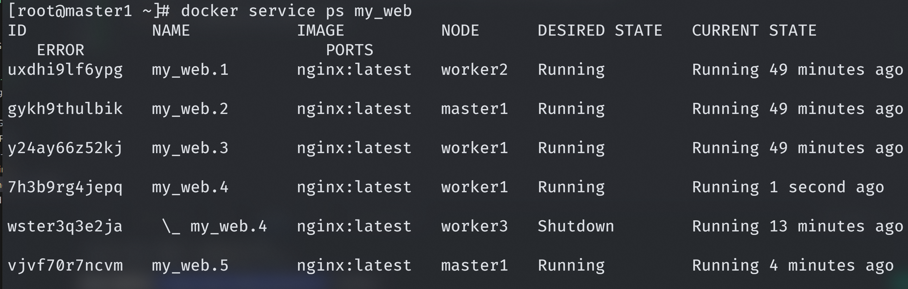

- 마스터 노드를 다운시키면 실행중이던 다른 노드의 컨테이너는 계속 실행은 되지만 총 스케일은 유지하지 못한다.

- 마스터 노드를 다시 올리면 총 스케일을 다시 맞춰서 스케줄링을 한다.

- 도커 스웜으로 서비스를 생성하면 overlay 타입의 네트워크가 생성이 되는데 마스터 노드가 다운되더라도 그 네트워크를 통해 서비스에 포함되는 살아있는 컨테이너가 트래픽을 전달받을 수 있다.

- 오버레이 네트워크는 각 호스트가 서로 통신할 수 있도록 하는 분산 네트워크이다. https://code-machina.github.io/2019/08/08/Docker-Swarm-Overlay-Network-Part-1.html

- `docker service update --image boooo0/web-site:v1.0 my_web`로 실행중인 모든 컨테이너를 새로운 이미지로 갱신해서 롤링 업데이트할 수 있다.

- 사설 레지스트리의 이미지도 똑같이 롤링 업데이트에 사용할 수 있다.

- 롤링 업데이트는 하나를 생성하면 하나를 지운다. 비율을 정해서 25%, 50%씩 생성한 다음 지우도록 할 수 있다. 기본은 25%

- `docker node update --availability drain worker1` - 한 노드의 가용성을 drain으로 변경하는 명령어인데 그 노드가 가진 모든 TASK를 빼내서 다른 노드로 옮긴다. 기본값은 active이다. 해당 노드 인스턴스에 문제가 있을 경우 사용한다고 한다.

- `docker node update --availability pause worker2` - pause 상태는 기존의 컨테이너는 유지되지만 `docker service scale my_web=8`처럼 스케일 아웃을 했을 때 worker2에는 TASK가 할당되지 않도록 한다.
